# Unity Shader测试工程的截图索引

##  shader基础知识与基础算法的复刻测试
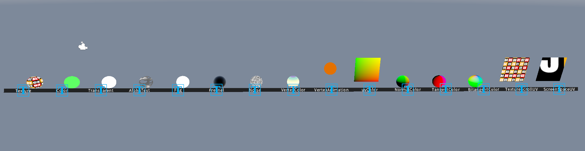
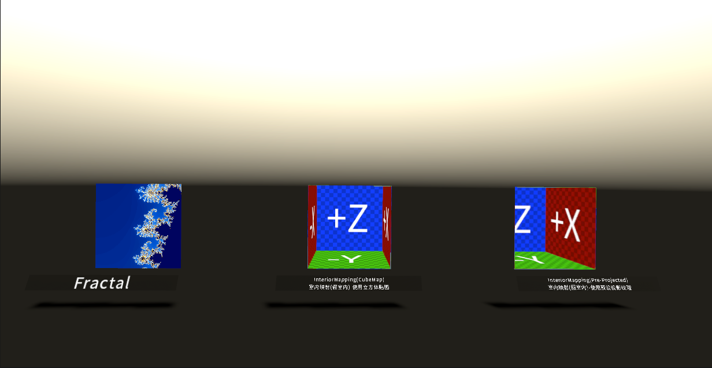
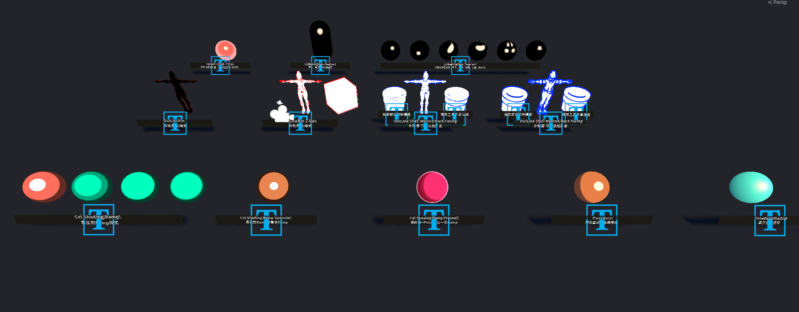
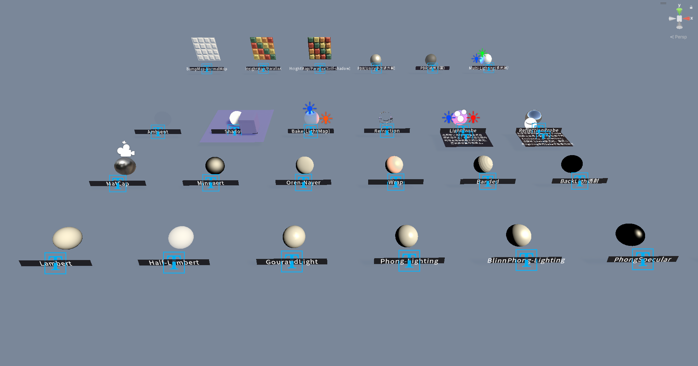

## Shader功能测试与原理验证
### 矩阵变换（移动、旋转、缩放）

*Info：  
1.特别需要注意测试当物体不在世界坐标原点时的测试结果，因此在测试代码中，做了物体在世界坐标中移动后的相关对比测试  
2.矩阵的变换需要注意移动、旋转、缩放在变换中的顺序问题，错误的顺序会产生不一样的结果*
  

*Info：  
1.uv的旋转和顶点的旋转本质上是相同的内容，区别在于一个是在3D空间下进行，一个是2D空间下进行  
2.对于纹理贴图的旋转通过在中心进行，而对于缩放默认应该是总UV坐标的原点开始（左下角和左上角）*

### 顶点动画

*Info：  
Gerstner的波动方程，在尺寸较小的模型上需要特别注意参数的数值调整，同时，该波动方程需要模型的面数足够支撑平滑的顶点偏移效果*

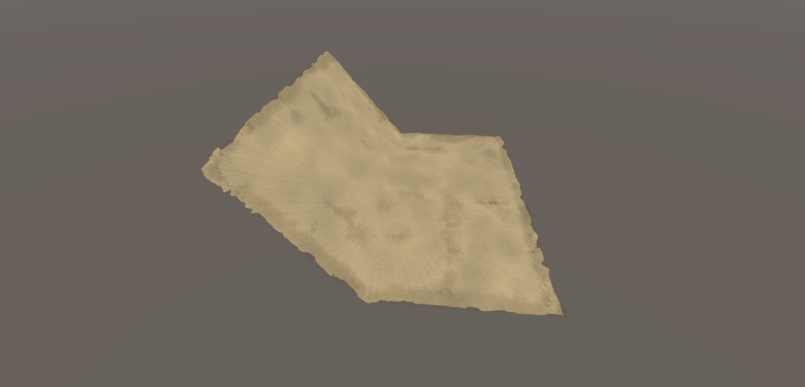  
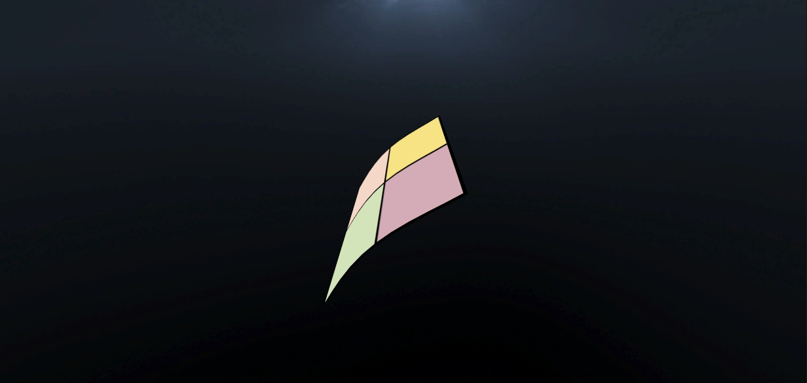  
*Info:  
对于翻书的正反面，这里使用的是双Pass来显示，可以使用vFace来显示。
*

![噪声动画])(ShootImage/NoiseAnimation.gif)  
*Info：  
在顶点阶段通过采样一张纹理贴图来作为噪声遮罩，特别需要注意在该阶段采样纹理所使用的函数。
*

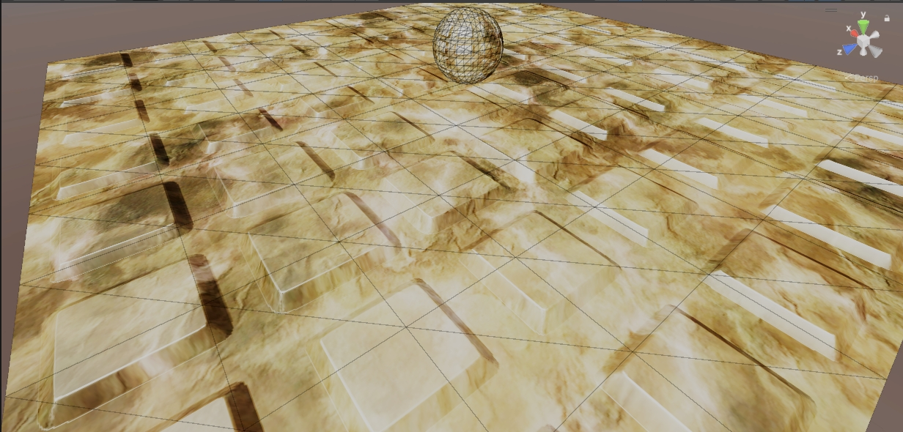  

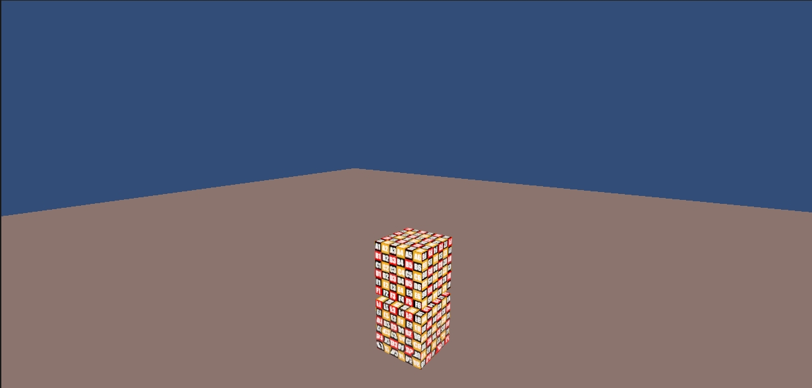  
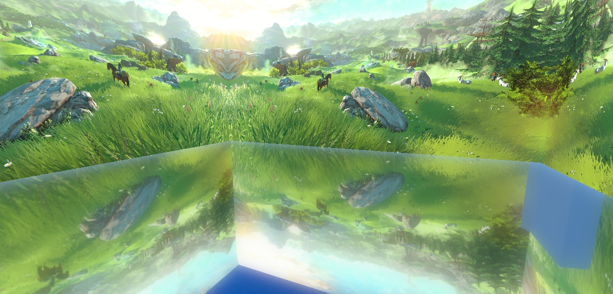  

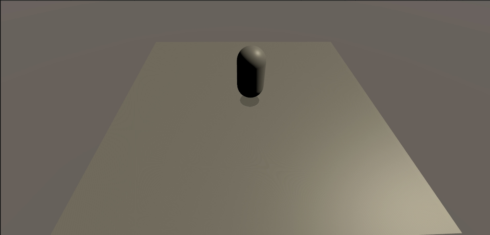  
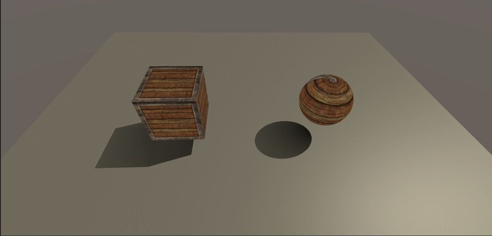  

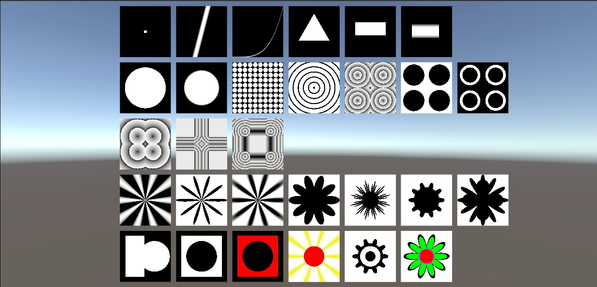  
