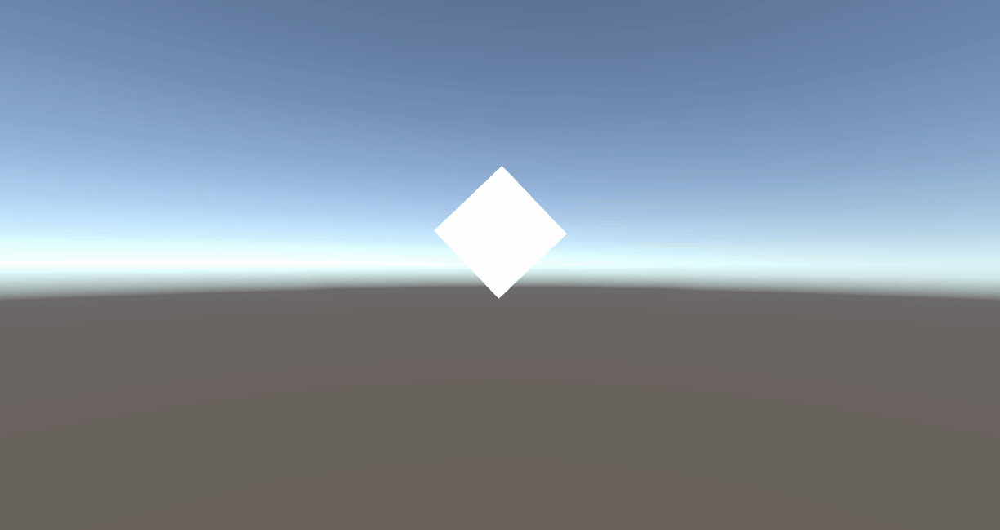
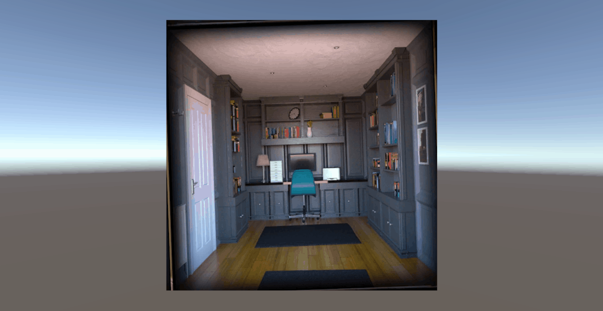
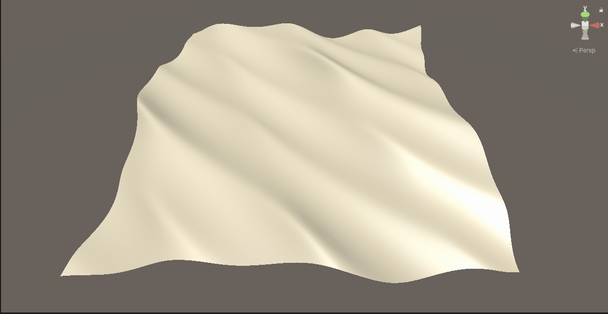

# Unity Shader测试工程提交日志记录
## 添加shader参考工具包

### 矩阵变换（移动、旋转、缩放）的原理测试

*注意：  
1.特别需要注意测试当物体不在世界坐标原点时的测试结果，因此在测试代码中，做了物体在世界坐标中移动后的相关对比测试  
2.矩阵的变换需要注意移动、旋转、缩放在变换中的顺序问题，错误的顺序会产生不一样的结果*
  

*注意：  
1.uv的旋转和顶点的旋转本质上是相同的内容，区别在于一个是在3D空间下进行，一个是2D空间下进行  
2.对于纹理贴图的旋转通过在中心进行，而对于缩放默认应该是总UV坐标的原点开始（左下角和左上角）*

*注意：  
Gerstner的波动方程，在尺寸较小的模型上需要特别注意参数的数值调整，同时，该波动方程需要模型的面数足够支撑平滑的顶点偏移效果*
